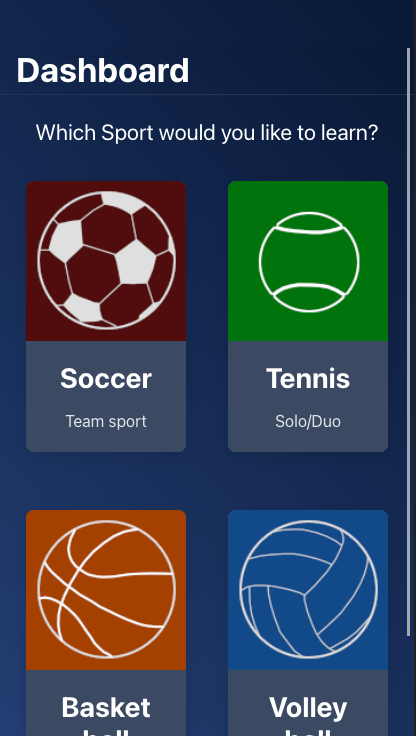
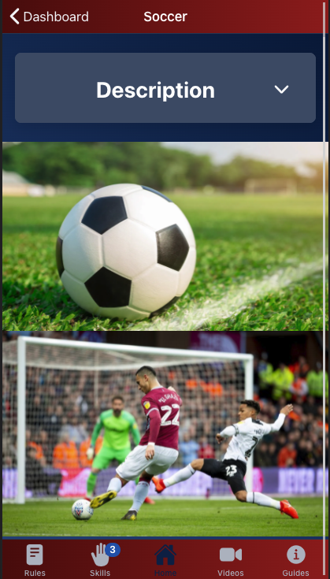
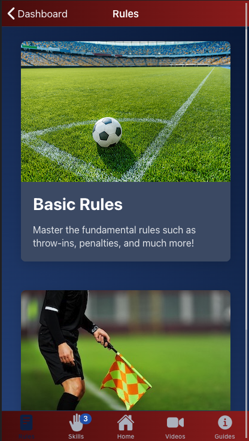
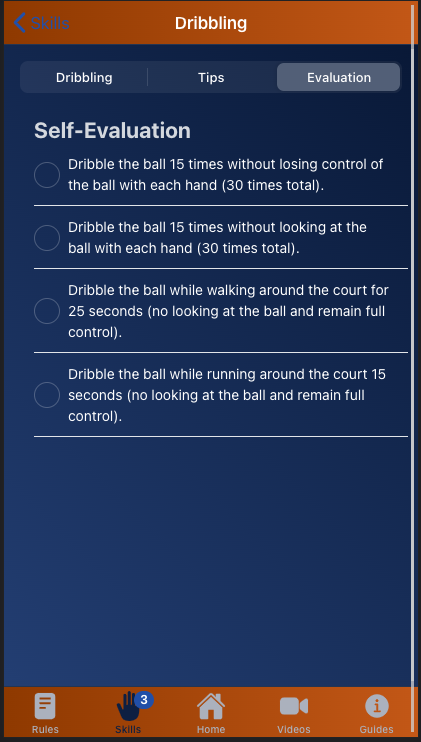
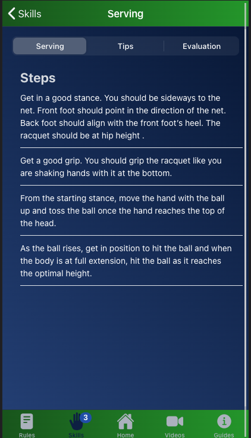
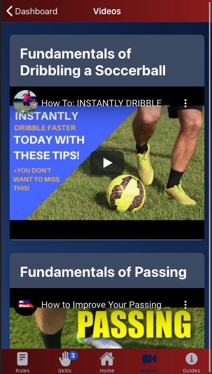

# PocketCoach: A Sports App

## About

Have you ever wanted to learn more about a sport?

PocketCoach is a revolutionary new mobile app that teaches you how to play a sport of your choice. Pick from options like Soccer, Tennis, Basketball, or Volleyball and just start learning!

PocketCoach eliminates the hassles around learning a Sport and provides you with all the information you need ranging from rules, techniques to proper equipment sizes.
The app also tracks your progression and motivates you to reach new levels in your journey!

<!-- <table>
<tr>
<td></td>
</tr>
</table> -->

| ||
|-|-|
| ||
| ||

**Team PocketCoach:**
- Abe Jeyapratap - *Lead Developer*
- Nicholas Hom - *Developer / Data Researcher*
- Brian Su - *Developer / Data Researcher*
- Wyman Li - *Developer / Data Researcher*

## Mission Statement

To inspires others to live an active, fun, and healthy lifestyle.

## Instructions

All team members of PocketCoach already have a local copy of the cloned git repository, which eliminates several of the following steps. However, in the situation that you need to clone the repository again, please follow these steps and enter the following commands on your command-line in your chosen directory.

### Setup & Installation

- Clone the Repository:

```git clone https://gitlab.cci.drexel.edu/fds21/70teamwebster/webster.git```

- Install required node modules for Ionic & Angular:

```bash
cd pocket-coach/
npm install
```

### Codebase Modifications

If you've successfully downloaded the required node modules, you will have a ```node_modules``` folder. You can now edit the codebase.

**General Note**: Please push all modified code from the parent directory ```webster/```

*Do NOT push any code without first pulling from the repository.*

### Testing & Deploying

Ionic comes in-built with a "Live Reload" option that we've enabled for convenient development. This means that when code edits are made and saved, the application will automatically compile and reload the Browser page called ```localhost:8100```

- Start a local development server for app dev/testing on Google Chrome:

```bash
cd pocket-coach/
ionic serve
```

**Note**: We use Google Chrome for testing of the app since it comes built with valuable Developer Tools such as multiple platform views. This can be enabled by toggling the device toolbar, and selecting a device such as "iPhone 6/7/8 Plus" or "Pixel 2 XL".

## Core Dependencies & Integrations

Ionic UI SDK and Angular are the two primary frameworks used in building PocketCoach.

Listed below are the primary dependencies along with Framework versions:
- Ionic - 5.5.2
- Angular - 11.2.0
- TypeScript - 4.0.2

For additional dependency details, please check ```package.json```
